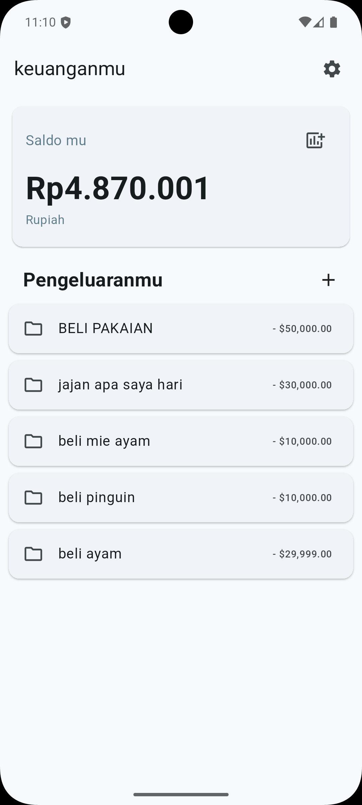
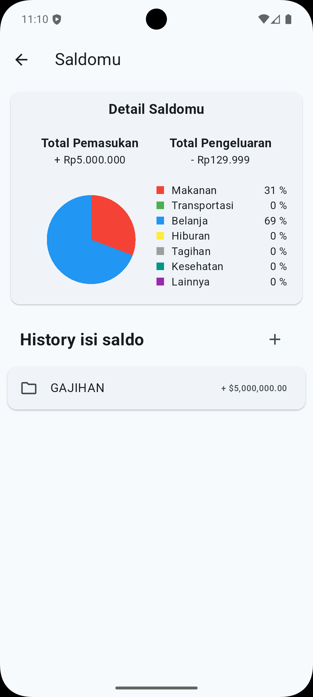
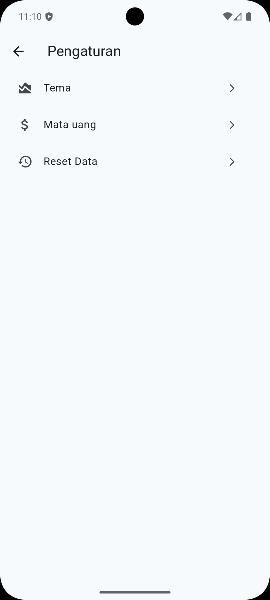

# 📊 Mounthly Expenses

Aplikasi Expense Tracker sederhana berbasis Flutter yang digunakan untuk mencatat, mengelola, dan memantau pengeluaran harian.

## ✨ Fitur Utama

- 📝 Tambah, edit, dan hapus transaksi.

- 💰 Dukungan multi-currency (Rupiah & Dollar).

- 🎨 Dark & Light Theme (persisten dengan SharedPreferences).

- 📅 Format tanggal otomatis.

- 📊 Ringkasan saldo & daftar transaksi.

## 🚀 Teknologi yang Digunakan

- [Flutter](https://flutter.dev/)

- [Riverpod](https://riverpod.dev/)
  – state management

- [SharedPreferences](https://pub.dev/packages/shared_preferences)
  – local storage

- [intl](https://pub.dev/packages/intl)
  – formatting date & currency

## 📱 Tampilan Aplikasi

<div align="center" style="display: flex; justify-content: space-around; flex-wrap: wrap; gap: 20px;">
    
    
    
    
</div>

## ⚙️ Instalasi

### clone repository ini

```bash
git clone https://github.com/username/expense_tracker.git
cd expense_tracker
```

### Install dependencies:

```bash
flutter pub get
```

### Jalankan aplikasi di device/emulator:

```bash
flutter run
```

## 📦 Build APK

### Untuk menghasilkan file .apk:

```bash
flutter build apk --release
```

### File akan tersedia di:

```swift
build/app/outputs/flutter-apk/app-release.apk
```

## 🛠️ Struktur Proyek

```bash
lib/
 | data/             # semua storage data
 |  |-- model/       # Model yang saya gunakan dalam project
 |  |-- utils/       # storage untuk utilitas
 | views/            # semua storage tampilan
 |  |-- pages/       # storage untuk pages/halaman
 |  |-- widget/      # storage untuk widget
 | main.dart         # Entry point
```

## 🙌 Kontribusi

### Pull request terbuka untuk fitur baru, perbaikan bug, atau peningkatan dokumentasi.

## 📄 Lisensi

### Project ini menggunakan lisensi MIT – silakan gunakan, modifikasi, dan sebarkan.
